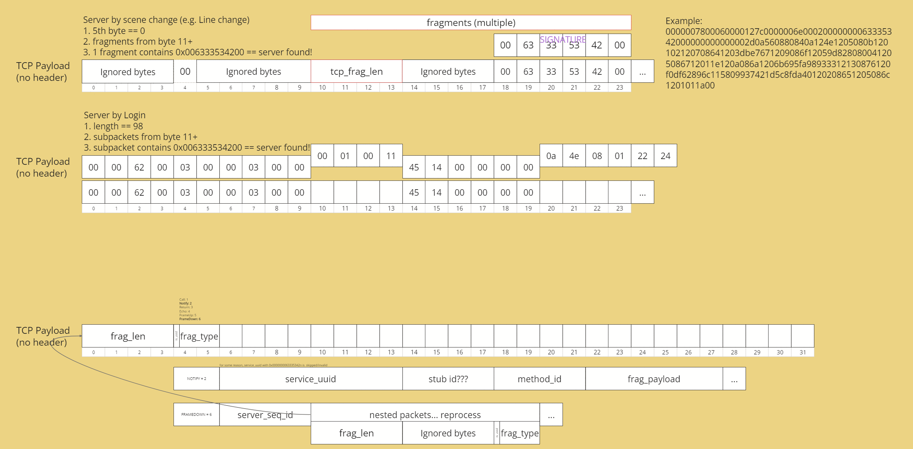

# BPSR-Logs Architecture Overview

## Technical Architecture

BPSR-Logs is a "blazingly fast" Blue Protocol: Star Resonance DPS meter built with Tauri 2.0, featuring a Rust backend and Svelte 5 frontend. The application intercepts and analyzes game network traffic to provide real-time combat metrics and damage tracking.

### Application Structure

The application follows a modular architecture with clear separation of concerns:

- **Entry Point**: `main.rs` → `lib.rs` → spawns `live_main.rs`
- **Two Main Windows**: 
  - `main` window: Settings and configuration interface
  - `live` window: Real-time overlay meter display
- **Backend**: Rust-based packet processing and analysis engine
- **Frontend**: Svelte 5 web interface with real-time updates

### Packet Capture Pipeline

The packet processing pipeline consists of four main stages:

#### 1. Packet Capture (`packet_capture.rs`)
- **WinDivert Integration**: Uses the WinDivert driver to intercept TCP packets at the network level
- **Server Identification**: Identifies the game server by analyzing packet signatures:
  - Looks for signature `[0x00, 0x63, 0x33, 0x53, 0x42, 0x00]` in packet payloads
  - Detects login packets with specific byte patterns
- **TCP Reassembly**: Handles fragmented TCP packets by maintaining sequence numbers and reassembling data streams
- **Filtering**: Captures only relevant game traffic, filtering out non-game packets

#### 2. Packet Processing (`packet_process.rs`)
- **Fragment Extraction**: Parses individual fragments from the TCP stream
- **Compression Handling**: Decompresses ZSTD-compressed packet data
- **Fragment Type Identification**: Identifies fragment types:
  - `Notify` (0x2): Contains game data notifications
  - `FrameDown` (0x6): Contains nested packet data
  - Other types: `Call`, `Return`, `Echo`, `FrameUp`
- **Service UUID Validation**: Ensures packets belong to the game service (`0x0000000063335342`)

#### 3. Fragment Decoding (`live_main.rs`)
- **Async Channel Communication**: Receives processed fragments via tokio channels
- **Protobuf Decoding**: Uses the `blueprotobuf` library to decode packet payloads
- **Packet Routing**: Routes decoded packets to appropriate handlers based on opcode
- **Error Handling**: Gracefully handles malformed or unknown packets

#### 4. Opcode Processing (`opcodes_process.rs`)
- **Combat Analysis**: Processes damage, healing, and skill usage data
- **Entity Management**: Tracks player and monster entities in encounters
- **State Updates**: Maintains encounter state including damage totals, skill usage, and entity information
- **Data Extraction**: Extracts meaningful metrics from raw packet data

### Packet Structure



The packet structure follows a layered approach:

```
TCP Packet
├── Fragment Length (4 bytes)
├── Fragment Type + Compression Flag (2 bytes)
│   ├── Bit 15: ZSTD Compression Flag (0x8000)
│   └── Bits 0-14: Fragment Type (0x7FFF)
├── Fragment Payload
│   ├── Service UUID (8 bytes) - for Notify fragments
│   ├── Method ID (4 bytes) - packet opcode
│   └── Protobuf Data (variable length)
```

**Example Packet Breakdown:**
```
0000007800060000127c0000006e00020000000063335342000000000000002d0a560880840a124e1205080b120102120708641203dbe7671209086f12059d828080041205086712011e120a086a1206b695fa98933312130876120f0df62896c115809937421d5c8fda40120208651205086c1201011a00
```

### Key Packet Types

The application processes five main packet types, each serving a specific purpose:

#### SyncNearEntities (0x00000006)
- **Purpose**: Notifies about entities appearing/disappearing in the area
- **Data**: Entity UUIDs, attributes (name, ability score, class, etc.)
- **Usage**: Tracks players and monsters entering/leaving combat encounters

#### SyncContainerData (0x00000015)
- **Purpose**: Provides detailed player information
- **Data**: Character name, level, class, ability score, profession, and comprehensive stats
- **Usage**: Establishes player identity and baseline statistics

#### SyncServerTime (0x0000002b)
- **Purpose**: Synchronizes server time
- **Data**: Server timestamp information
- **Usage**: Currently processed but not actively used for metrics

#### SyncToMeDeltaInfo (0x0000002e)
- **Purpose**: Contains information about the local player
- **Data**: Player UUID, attributes, and self-targeted actions
- **Usage**: Identifies the local player and tracks self-applied effects

#### SyncNearDeltaInfo (0x0000002d)
- **Purpose**: Contains information about nearby entities' actions
- **Data**: Entity UUIDs, damage events, skill usage, and attribute changes
- **Usage**: Primary source for combat metrics including damage dealt, healing, and skill tracking

### Data Flow Summary

1. **Network Capture**: WinDivert intercepts TCP packets from game server
2. **Server Detection**: Identifies game server through packet signature analysis
3. **TCP Reassembly**: Reconstructs fragmented TCP streams
4. **Fragment Processing**: Extracts and decompresses individual packet fragments
5. **Protobuf Decoding**: Converts binary data into structured game events
6. **Combat Analysis**: Processes events to extract damage, healing, and skill metrics
7. **UI Updates**: Real-time display of metrics in overlay window

---

## Original Development Notes

*The following section contains the original Discord chat logs from winjwinj (the developer of bpsr-logs) that provided the foundation for this architecture analysis.*

### Discord Chat Logs

**winjwinj** — 9/16/2025 3:35 AM

scuffed but how the packets work
(i used noteely) 


**Example Packet:**
```
0000007800060000127c0000006e00020000000063335342000000000000002d0a560880840a124e1205080b120102120708641203dbe7671209086f12059d828080041205086712011e120a086a1206b695fa98933312130876120f0df62896c115809937421d5c8fda40120208651205086c1201011a00
```

**Rough Flow:**
- `main.rs` - points to `lib.rs`
- `lib.rs` - starts the app
- `live_main.rs` - starts capture + receives processed fragments
- `packet_capture.rs` `read_packets()` - uses windivert to read packets + finds game server ip + tcp reassembly
- `packet_process.rs` `process_packet` - processes the packet into individual fragments + sends back to `live_main.rs` to get metadata
- `live_main.rs` - receives fragments to extract metadata (damage, etc.)

**winjwinj** — 9/16/2025 3:45 AM

**Packet Types:**
- **SyncNearEntities** - entities that appear/disappear (contains attributes like name, ability score, class, etc.)
- **SyncContainerData** - super detailed data about (yourself), has name, ability score, class, season pass level, housing, guild, literally everything
- **SyncContainerDirtyData** - name, ability score, cur hp, max hp, class
- **SyncServerTime** - does what it says (i think?)
- **SyncToMeDeltaInfo** - mainly used to figure out the uid of myself
- **SyncNearDeltaInfo** - sent everytime an entity does an action to another entity (e.g. x does damage to y)